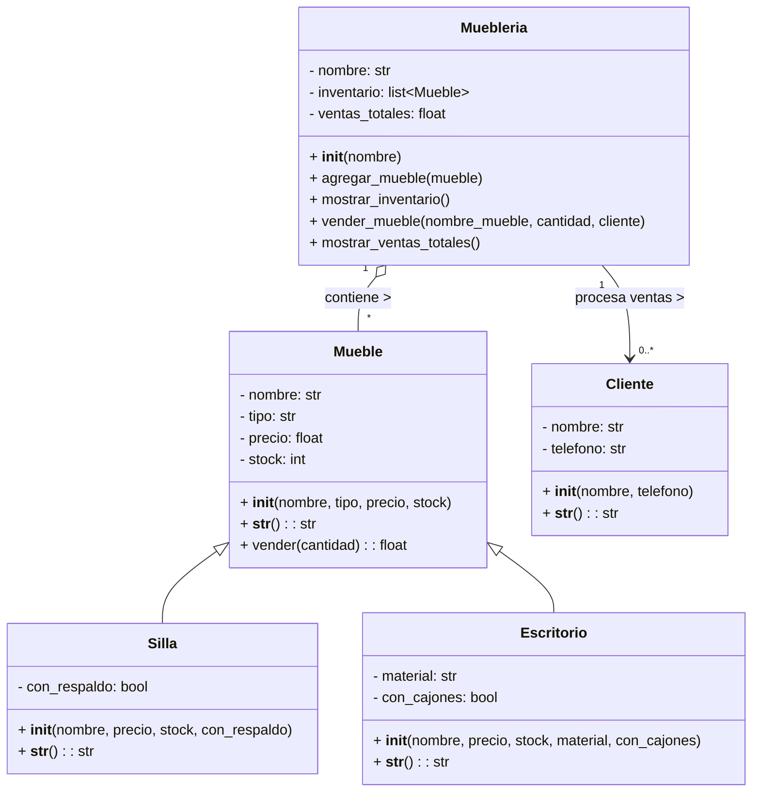

# Diagramas del proyecto Muebles

## Diagrama de Clases

```mermaid
classDiagram
    %% ======================
    %% Clases base
    %% ======================

    class Mueble {
        - nombre: str
        - tipo: str
        - precio: float
        - stock: int
        + __init__(nombre, tipo, precio, stock)
        + __str__(): str
        + vender(cantidad): float
    }

    class Silla {
        - con_respaldo: bool
        + __init__(nombre, precio, stock, con_respaldo)
        + __str__(): str
    }

    class Escritorio {
        - material: str
        - con_cajones: bool
        + __init__(nombre, precio, stock, material, con_cajones)
        + __str__(): str
    }

    class Cliente {
        - nombre: str
        - telefono: str
        + __init__(nombre, telefono)
        + __str__(): str
    }

    class Muebleria {
        - nombre: str
        - inventario: list~Mueble~
        - ventas_totales: float
        + __init__(nombre)
        + agregar_mueble(mueble)
        + mostrar_inventario()
        + vender_mueble(nombre_mueble, cantidad, cliente)
        + mostrar_ventas_totales()
    }

    %% ======================
    %% Relaciones
    %% ======================

    Mueble <|-- Silla
    Mueble <|-- Escritorio

    Muebleria "1" o-- "*" Mueble : contiene >

    Muebleria "1" --> "0..*" Cliente : procesa ventas >
```

